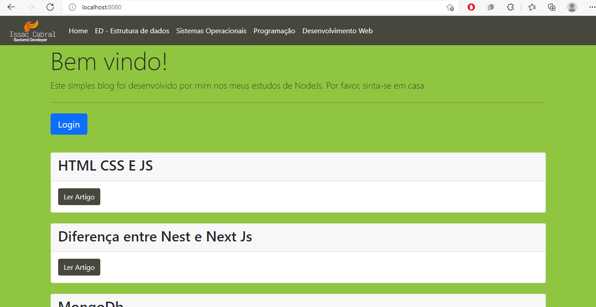
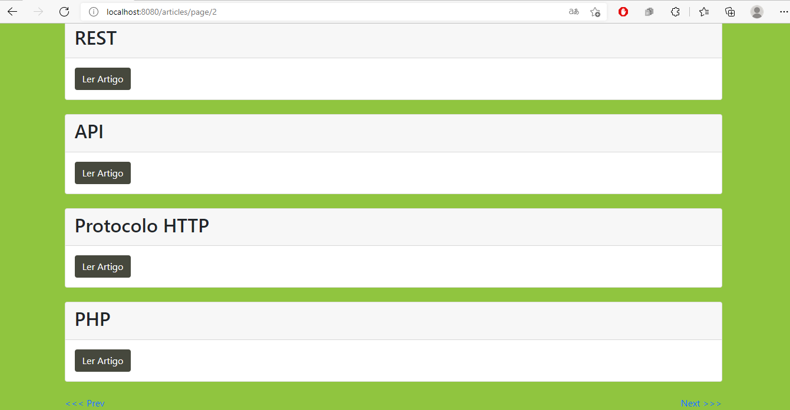
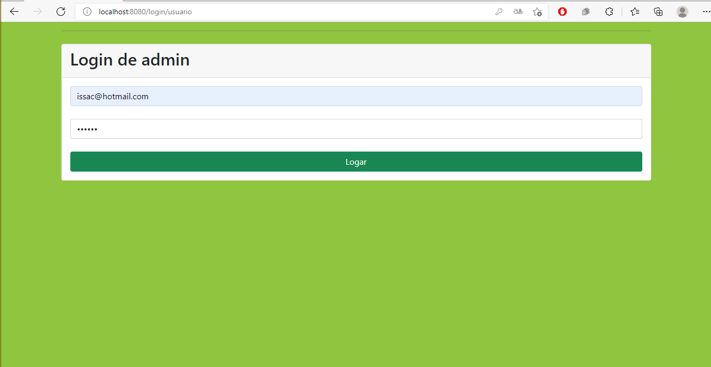
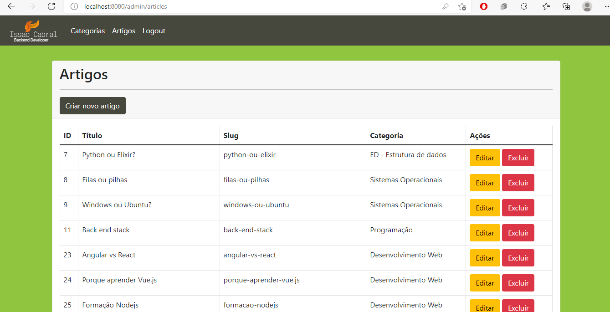
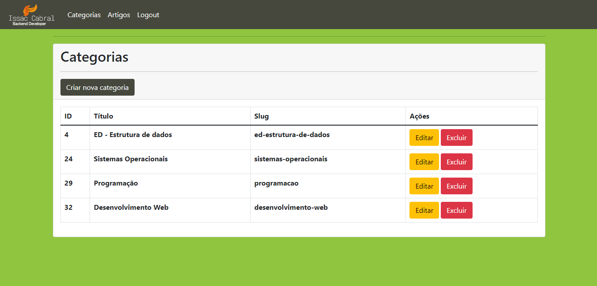
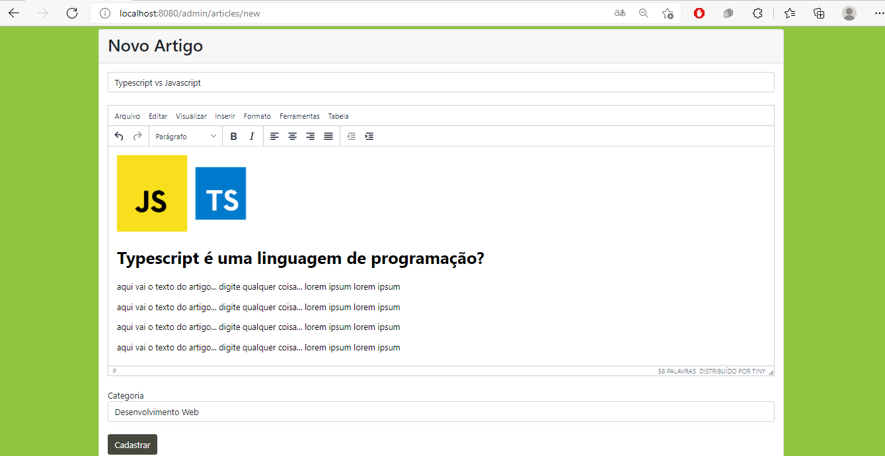
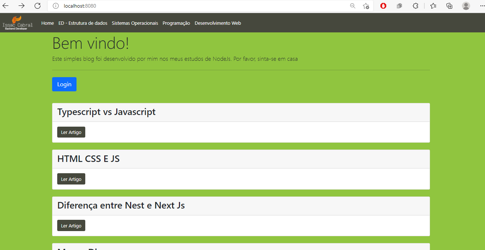
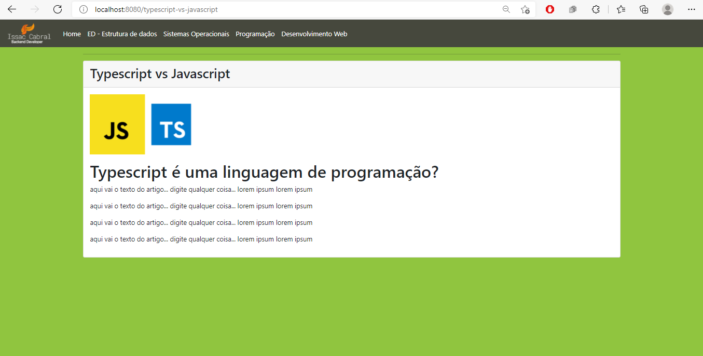

<h2>A blog with admin panel, made using pagination, authentication, login system and text editing for articles</h2>

Technologies I used:
* Node Js
* Express
* ORM: Sequelize
* Postgres
* Bootstrap
* middleware

<h2>The project:</h2>
Is a blog where, depending on the type of user, you can view or manipulate articles and categories with all CRUD operations. We list, paginate and create an authentication system that uses email and password  

<h2>What I learned:</h2>

* learned to create relationships and tables by mapping models using sequelize
* a little authentication
* section system
* improved my primal skills using Node and  express and some HTTP methods

<h2> Next Steps: </h2>

* Typescript
* Async/await
* API REST

<h2>Main Page:</h2>

<h2>Pagination:</h2>

<h2>Login Page:</h2>

<h2>Admin pages:</h2>

<h2>Creating and article:</h2>

<h2>Now let's visualize it</h2>

*feel free to dig through the files, thank you so much*